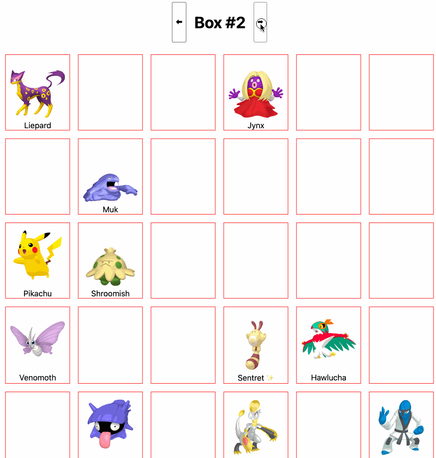
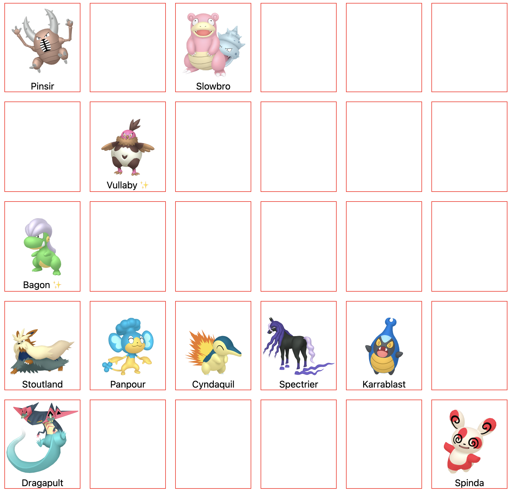
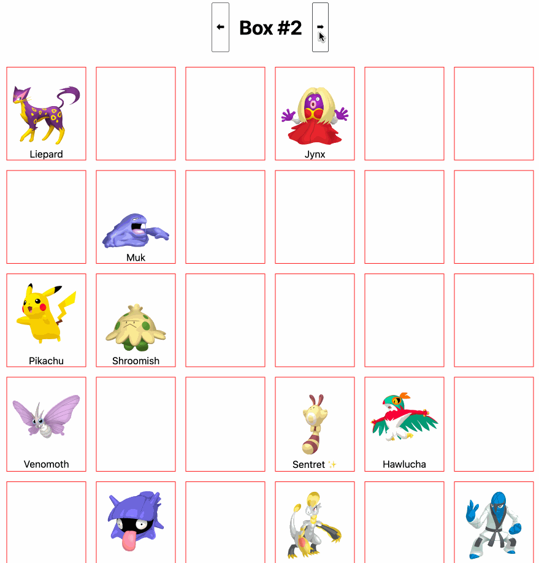
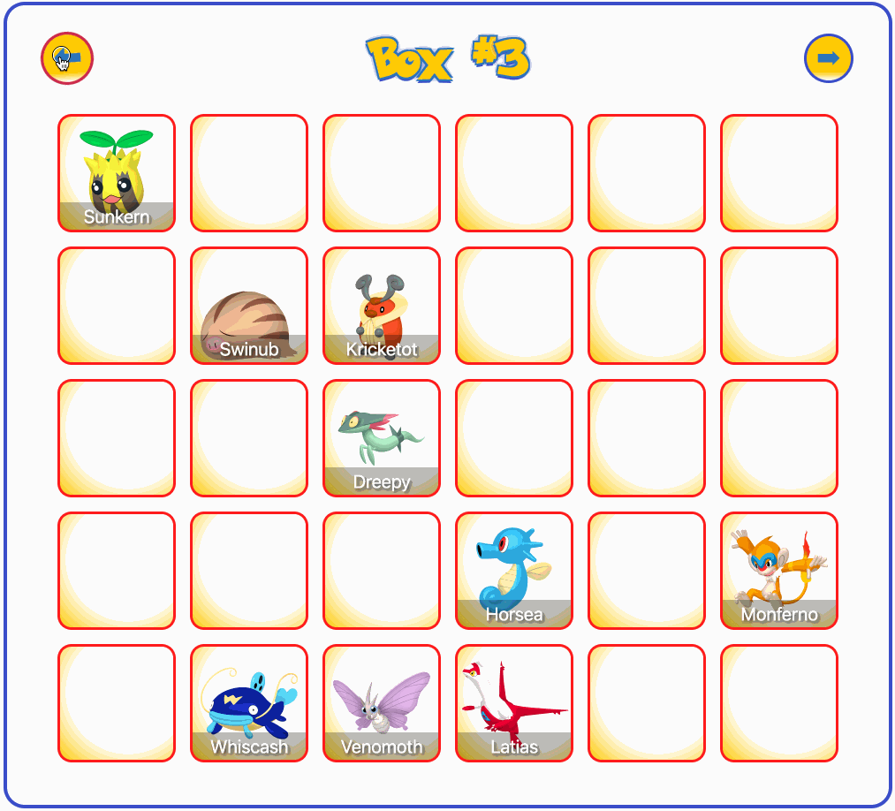

# COMPSCI 732 Test, May 2025: A Pokemon Box System

## Introduction

This test is designed to asses your individual experience with the MERN stack, in addition to undertake (possibly AI-assisted) rapid application development within a time limit. In this test, you will build both the frontend and backend for a system which allows users to organize Pokemon in boxes.

A GIF of the completed application can be seen here:



## Test instructions

1. This test has a **3.5-hour time limit** (with roughly an extra 15-minute grace period to account for things like slow internet connections, etc).
2. Your personal time limit begins once you "accept" this assignment on GitHub Classroom (i.e. it will be the timestamp of the initial GHC commit).
3. Your latest commit to the **`main`** branch _within the time limit_ will be taken as your submission.
4. Commits too far after the time limit will be ignored (considering a reasonable grace period as mentioned above).
5. Commits on other branches will be ignored.
6. We **highly** recommend committing and pushing _often_ - as soon as you've gotten a step / task working!
7. The tasks below are organized by database → backend → frontend. I recommend you follow that order, but you don't have to. You can still receive marks for later sections even if you don't finish earlier sections.
8. Use of extra `npm` packages is allowed and encouraged. If you do, make sure they are properly added to `package.json` (which should automatically happen when you install them).
9. We have provided several unit test files in both the backend (for testing API routes) and frontend (for testing some basic UI stuff and custom hook). **You must not modify these files. If you do, you will receive heavy penalties for the test.**
10. Collaboration with other _humans_, whether online or in-person, is not allowed. Suspected cased of plagiarism will be dealt with harshly.
11. Collaboration with _robots_ 🤖 (i.e. use of GenAI) is allowed and encouraged. _The test has been written assuming you will be using such tools to help you_. Please briefly fill out the section at the end of this README to let us know how you used it.

Please sign here to indicate that you have read and understand all of the above:

```Wenduo
[Wenduo Xu]
```

## Task Zero - Building and Understanding

Before jumping into development, make sure you `npm install` in both the `frontend` and `backend` folders. Make sure you have access to some kind of MongoDB instance too. Use of a local instance is recommended, but using an Atlas cluster is also fine. If you are using an Atlas cluster, please modify the backend's `.env` file to change the `DB_URL` environment variable as appropriate

Once you've got your MongoDB insta `nce running, and have installed dependencies, do an `npm run dev `in both the`frontend `and`backend` to make sure they run without error.

Before proceeding, please look at all the source files provided to you. Please also look at the provided unit tests, as these will help you determine whether you are meeting the requirements.

## Task One - Backend (40% in total)

In this task, we'll work on the backend. We have provided extensive API unit tests (in `src/routes/__tests__/api-boxes.text.js`) to help you test your code. Once you start working on step 2 and onwards below, we recommend having vitest running so you can see how your changes affect the unit test results.

While 100% tests passing does not guarantee full marks for the backend, it's a pretty good indication!

### Step 1 - mongoose schema (5%)

In the backend's `src/data/schema.js` file, complete `pokemonSchema` and `boxSchema` as follows:

- Pokemon should have a `dexNum` (number), `name` (string, required), `isShiny` status (boolean), a `normalImageUrl` (string), and a `shinyImageUrl` (string).
- Boxes should have a `boxNumber` (number, required, unique), and an array of `pokemon`. Each entry in the `pokemon` array should be an `ObjectId` corresponding to the \_id of one of the Pokemon in the system.

After completing this step, you should be able to initialize the database by running `npm run init-db`. The script will create several boxes, each with a certain number of "slots" to hold Pokemon, and will fill some of those slots with Pokemon pulled from [pokeapi.co](https://pokeapi.co/). The number of boxes / slots to create, and the number of possible species of pokemon, can be configured with several environment variables.

The script, for your reference, can be found in `src/scripts/init-db.js`.

### Step 2 - Fetching a box (15%)

For the remaining steps in Task One, you'll be writing Express route handlers, in `src/routes/api-boxes.js`. Make use of the provided unit tests to check your progress!

For this step, write a `GET` route handler for `/api/boxes/:boxNumber`. This accepts a single path parameter, `boxNumber`, and does the following:

- If `boxNumber` is not a number or is less than 1, return a `400` status code with an appropriate error message, such as "Invalid box number".
- If a box with the given `boxNumber` does not exist, return a `404` status code with an appropriate error message, such as "Box not found".
- Otherwise, return JSON of the given box, **including all Pokemon in that box** (_not just their `_id`s_).

  **Note:** When using [populate()](https://mongoosejs.com/docs/api/model.html#Model.populate()), you will need to specify `retainNullValues: true` as an option. We are using `null` to mean "empty slot", but nulls are removed by default when using `populate()`:

  ```js
  const box = await Box.findOne(/*your_query_here*/).populate({
    path: "pokemon",
    retainNullValues: true,
  });
  ```

When returning a valid box, you should also (conditionally) set two custom HTTP response headers:

- If `boxNumber` is greater than 1, set the `previous-box` header to `boxNumber` minus 1
- If `boxNumber` is less than the number of boxes (you could check how many boxes are in the database or use the `NUM_BOXES` environment variable), set the `next-box` header to `boxNumber` plus 1.

### Step 3 - Swapping Pokemon (20%)

In this step, we'll implement logic allowing users to swap the positions of two Pokemon (whether they are in the same or different boxes), or move a Pokemon into an empty slot.

Implement a `PATCH` route handler for `/api/boxes`, as follows.

1. We expect the request body to be JSON format object with the following structure:

   - The body is an object with a single property named `swap`.
   - The `swap` property is itself an object with two properties: `source` and `target`.
   - Both `source` and `target` are objects with two properties each: `boxNumber` and `slotNumber`.
   - Each provided `boxNumber` and `slotNumber` must be integers greater than 0.

   If the request body is not in the correct format (as described above), return a `422` error with an appropriate error message. Ideally the message should describe what is wrong with the data, but simply "Data format error" is fine for this test.

   **Hint:** We suggest you use an `npm` package, such as [`yup`](https://www.npmjs.com/package/yup), [`joi`](https://www.npmjs.com/package/joi), or others, to help with this (but you don't have to, if you really want to write all that logic by hand).
2. Assuming the data is in the correct format, the method should next find both the source and target boxes in the database (using the `boxNumber`s provided). If either does not exist, a `404` should be returned with an appropriate error message such as "Source or destination box not found".
3. Read the element in the source box's `pokemon` array corresponding to the source `slotNumber` (**Hint:** Remember that arrays start at index 0 but `slotNumber` starts at 1). If there is no source pokemon, return a `404` error with an appropriate message.
4. Move the source pokemon to the given target box and slot. If the target box / slot had a pokemon too, remember to move that to the source box and slot (i.e. swap them).
5. Save the source and target boxes, and return a `204` status code to indicate success.

Once you complete this step, all backend unit tests should now be passing. If any unit tests are failing, make sure to look at those tests, and why they are failing, to give you clues to help you fix any bugs.

## Task Two - Frontend (50% in total)

Now that we've completed the backend, let's move onto the frontend.

### Step 1 - useBox() hook (20%)

Firstly, we'll complete the `useBox()` hook, defined in `src/hooks/useBox.js`. This function accepts a single `boxNumber` as an argument, and defines several stateful values.

Complete the function as follows:

1. Complete the `fetchBox()` async function so that it will try to call your `/api/boxes/:boxNumber` route written in Task One.

   - If successful, it will set the `box`, `hasNext`, and `hasPrevious` stateful values according to the data in the response. **Hint:** When using axios, you can get a header value using `response.headers.get("my-header")`.
   - If not successful, it will set the `box` to `null`, the `hasNext` and `hasPrevious` values to `false`, and set the `error` to the thrown error object.
   - Either way, it will set `isPending` to `false`.

   **Hint:** Remember to use `API_BASE_URL` which is defined at the top of the file.
2. Add a `useEffect()` hook which will call the `fetchBox()` function. The `fetchBox()` function should run whenever `boxNumber` changes.
3. Complete the `swap()` function, which takes a `source` and `target` as arguments. You should try to call your `PATCH /api/boxes` route you wrote in Task One. You can provide data which looks like this:

   ```js
   const data = {
     swap: {
       source,
       target,
     },
   };
   ```

   - If successful, and either the source or target `boxNumber` are equal to the current `boxNumber`, then refresh the data by calling `fetchBox()` again.
   - If not successful, set `error` to the thrown error object.

Once this step is complete, the unit tests in `useBox.test.js` should all pass.

### Step 2 - Box page (5%)

In this app, we are using React Router, so that each box is visible on its own page. In this step, we will configure the application routes.

1. Firstly, create a new React component in the `components` folder, called `BoxPage.jsx`. This should use React Router's `useParams()` hook to read the `boxNumber` path parameter. For now, just display it in a header, such as:

   ```html
   <h1>Box #1</h1>
   ```

   if the current `boxNumber` is 1.
2. Import that component into `App.jsx`, and create a new `Route`, which will display a `BoxPage` when the `path` is `/boxes/:boxNumber`.

Since the default route already navigates to `/boxes/1`, you should see your component on-screen. Changing the route manually in the browser URL should let you see different numbers.

### Step 3 - Page navigation (5%)

In this step, we'll continue editing `BoxPage`. Start by calling your `useBox()` hook appropriately, and getting its values. For example:

```js
const { box, isPending, hasNext, hasPrevious, error, swap } = useBox(boxNumber);
```

Then, complete the `BoxPage` UI as follows:

1. There should be a heading with the text "Box #1" (replace "1" with the actual `boxNumber`).
2. There should be two buttons: One for navigating to the "previous" box and another for navigating to the "next" box.

   - These should be enabled or `disabled` based on the `hasNext` and `hasPrevious` values from your hook.
   - When clicked, navigate back or forward (depending on which button was clicked). You can choose to use React Router's `useNavigate()` hook to get a `navigate()` function to call, or you can use React Router `<Link>` components with appropriate `to` props set, instead of buttons.
3. If `isPending` is set, the text "Loading" should appear on the page.
4. If `error` is set, the error's message text should appear on the page.
5. If `box` is set, then we will display the actual pokemon in the next step. For now, you can just display a paragraph with the text "Pokemon Go Here".

As an example, of what this step should look like in the browser, see this image:


You don't have to style your UI in exactly the same way, but all the components need to be there.

### Step 4 - Displaying pokemon (20%)

Next, we'll create a new component called `Box.jsx`, in the `components` folder. This should accept the `box` supplied by your hook as a prop.

You will need to create the following CSS minimum CSS styles for the component (either as global CSS or CSS modules - it doesn't matter):

- The `Box` should be displayed as a CSS grid with 6 columns (this will mean there are 5 rows, as the data is set up to have 30 slots per box).
- There should be some noticeable `gap` between each "cell" in the grid (I used `1rem`), as well as some `padding` around the grid (I also used `1rem`).

Now, create _another_ component, called `Slot`. Each slot represents a single slot in a box, which may or may not contain a pokemon. The `Slot` component should accept a single `prop`, called `pokemon` (which may be `null` if the associated slot doesn't contain a pokemon).

If a `Slot` contains a `pokemon`, it should display the pokemon's `name`, along with an `` whose `src` will be set to either the pokemon's `normalImageUrl` or `shinyImageUrl`, depending on whether the pokemon's `isShiny` property is true or false. If a pokemon is shiny, then the ✨ emoji can also be placed next to its name.

The `Slot` should be styled as follows:

- It should have an obvious border
- It should have a fixed width - I used `128px`. It should also have a `min-height` set to the same value, so slots without pokemon still have some height.
- Any `` elements inside the slot should have their `width` set to `100%`
- Any text in the slot (or its children) should be centered.

Finally, at an appropriate place within your `Box` component, loop through the `box`'s `pokemon` array and render a `Slot` component for each element in the array.

As an example of what your `Box` component with 30 `Slot` components should look like, see this image:



Again, yours doesn't have to look exactly like this, except for the general 6-column grid layout.

When combined with your `BoxPage` from the previous step, you should now be able to navigate between different boxes using the buttons / links, as shown here:



## Task Three - Ultimate A+ Extension Task - Drag-And-Drop (10%)

If you complete all of the previous tasks well, you can receive up to 90% for this test. For the final 10%, implement the drag-and-drop feature you can see on the animation at the top of this README.

Since this is the A+ question, you just get two hints:

1. I recommend you use the [`react-dnd`](https://react-dnd.github.io/react-dnd/about) npm package to help wit this.
2. GitHub Copilot / ChatGPT / etc is your friend...

## Task Four - GenAI (0%, but please fill this in if you have time)

For this final "task", please write how you used GenAI for this test, whether you found it helpful, and whether it presented any unexpected challenges.

TODO Your Text Here.

## Task Five - Fun with CSS (Also 0%)

If you finish everything else with time to spare, feel free to experiment with use of GenAI to implement non-trivial CSS styling for your app. This is what I came up with in about 20 minutes of playing around:



If you want to continue to play around with this after the three-hour time limit, feel free to do so - but in that case, please push to a different branch to make marking easier!
